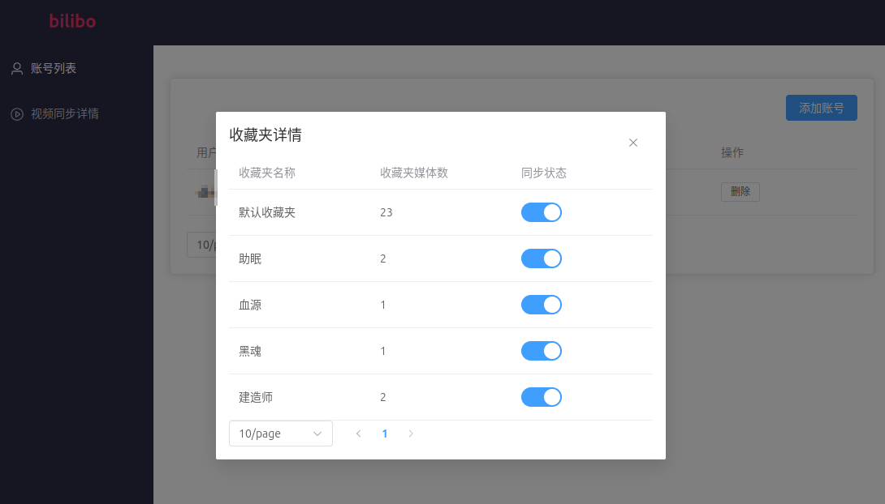

## 简介
我家猫看B站发现有些收藏的视频失效了，于是他自己用GO写了一个程序，专门定时下载多个账号的收藏夹视频。

他叫啵啵，所以项目就叫bilibo了

## 运行步骤
- 复制项目下的`config.yaml.example`为`config.yaml`
- 对应修改配置项
- unix系统：`chmod +x bilibo`，执行`config=config1.yaml ./bilibo`运行程序
- 打开配置中的server.host&port，默认：`localhost:8080`

## 预览图

## 路线图
- [x] 多账号
- [x] 设置同步收藏夹
- [x] 视频下载
- [x] 已下载视频浏览
- [x] 预览视频
- [x] 同步详情
- [x] 提供docker分发方式
- [ ] 支持单一视频下载
- [ ] 支持`我的收藏和订阅`

## 参考与借鉴(PS:这段都是抄袭bili sync的)

该项目实现过程中主要参考借鉴了如下的项目，感谢他们的贡献：

+ [bili sync](https://github.com/amtoaer/bili-sync) 基于 rust tokio 编写的 bilibili 收藏夹同步下载工具。
+ [bilibili-API-collect](https://github.com/SocialSisterYi/bilibili-API-collect) B 站的第三方接口文档
+ [bilibili-api](https://github.com/Nemo2011/bilibili-api) 使用 Python 调用接口的参考实现
+ [danmu2ass](https://github.com/gwy15/danmu2ass) 本项目弹幕下载功能的缝合来源